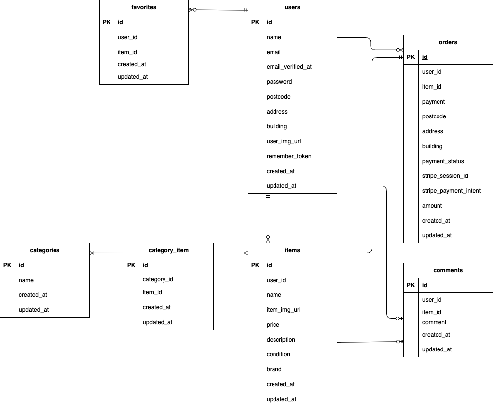

# test2

## プロジェクト概要
このプロジェクトは「coachtechフリマ」の開発計画に基づいたフリマアプリケーションです。

ユーザー登録・ログイン、商品出品・購入、コメント、Stripe 決済、メール認証などの機能を備えています。

開発の目的は「アイテムの出品と購入を行えるフリマアプリを実装し、初年度でのユーザー数1000人達成」を目標としています。

## 環境構築手順

1. リポジトリをクローン

   `git clone https://github.com/yu1021-soni/test2.git`

2. Docker起動

3. プロジェクト直下で、以下のコマンドを実行する

    `make init`

    Apple Silicon (M1/M2) でビルドできない場合

    docker-compose.yml の services.mysql に以下を追加してください

    ```
    services:
        mysql:
            platform: linux/x86_64(この文追加)
            image: mysql:8.0.26
            environment:
    ```

4. Stripe の PHP SDK を追加インストール

   `make stripe`

## Stripeを使用した決済行う場合

   Stripe のキーは各自でダッシュボードから発行してください
   取得したキーは `.env` に設定します

   別ターミナルで以下を実行してください（起動中は閉じないこと）

   `stripe listen --forward-to http://localhost/stripe/webhook`

   ※ ターミナルを閉じると Stripe Webhook が届かなくなり、DBに反映されません。

## メール認証テスト

   Mailhogを利用。

   ブラウザで以下にアクセス。

   http://localhost:8025

   `php artisan queue:work`

## テスト実行
1. テスト専用の環境設定ファイル .env.testing を用意
2. .env.testingに以下を記述

   テスト用アプリケーションキーの作成

   `php artisan key:generate --env=testing`
   ```
   APP_ENV=testing
   APP_KEY=base64:xxxxxxxxxxxxxxxxxxxxxxxxxxxxxxxxxxxxxxx

   APP_DEBUG=true

   DB_CONNECTION=sqlite
   DB_DATABASE=:memory:

   CACHE_DRIVER=file
   SESSION_DRIVER=file
   QUEUE_CONNECTION=sync
   ```

3. テスト実行

`php artisan test`

## 一般ユーザー情報
Seeder により以下のユーザーが作成されます。

いずれも **パスワードは `password`** です。

- 出品者A / sellerA@example.com  
- 出品者B / sellerB@example.com  
- 未紐付ユーザ / free@example.com  

## 使用技術

・基盤
- PHP 8.1.33
- Laravel 8.83.29
- Mysql 8.0.26
- nginx 1.21.1
- Composer 2.8.12
- Docker / Docker Compose

・主要パッケージ
- Laravel Fortify
- PHPUnit

・開発用ツール
- phpMyAdmin
- Mailhog

## ER図


## URL
- アプリケーション: http://localhost
- phpMyAdmin: http://localhost:8080
- Mailhog: http://localhost:8025
